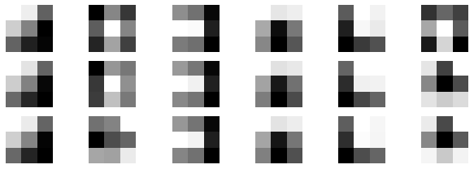
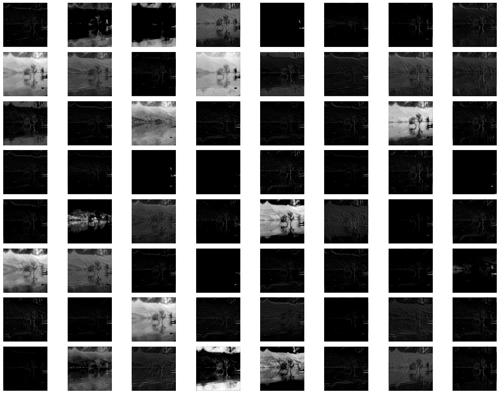
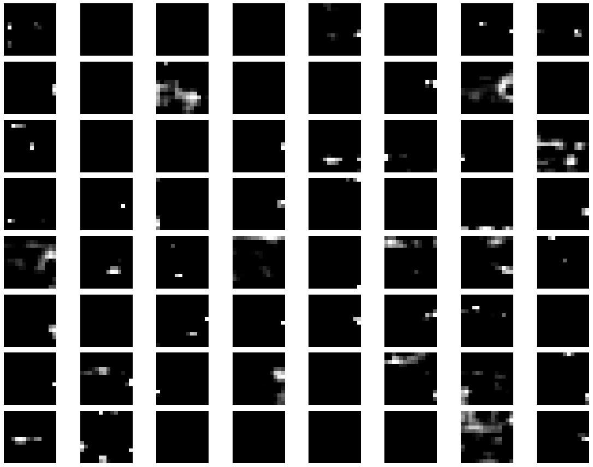
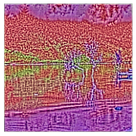
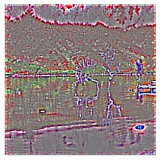
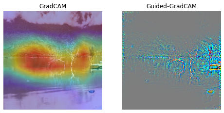
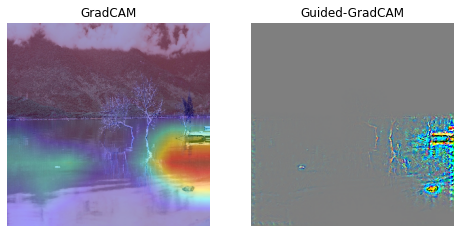

# CNN Visualization and Explanation
This work aims to:
* Visualize filters and feature maps of all pre-trained models on ImageNet in [`tf.keras.applications`](https://github.com/conan7882/CNN-Visualization) with `Tensorflow` verion 2.3.0. The visualization methods include simply plotting filters of the model, plotting the feature maps of convolutional layers, DeConvNet and Guided Backpropagation
* Explain for the top 5 predictions of these models by GradCAM and Guided-GradCAM

With the current version, there are 26 pre-trained models.
## Briefs
Filter: VGG16, `block1_conv1`

Feature maps: VGG16, `block1_conv1`

Feature maps: VGG16, `block5_conv3`

Guided backprop: VGG16, `block1_conv1`

Guided backprop: VGG16, `block5_conv3`

GradCAM & Guided GradCAM for class **lakeside**

GradCAM & Guided GradCAM for class **boathouse**



## How to use
### Run with your resource
* Clone this repo:
```bash
git clone https://github.com/nguyenhoa93/cnn-visualization-keras-tf2
cd cnn-visualization-keras-tf2
```
* Create virtualev:
```bash
conda create -n cnn-vis python=3.6
conda activate cnn-vs
bash requirements.txt
```
* Run demo with the file `visualization.ipynb`

### Run on Google Colab
(to be updated)

## References
1. [How to Visualize Filters and Feature Maps in Convolutional Neural Networks](https://machinelearningmastery.com/how-to-visualize-filters-and-feature-maps-in-convolutional-neural-networks/) by Machine Learning Mastery
2. Pytorch CNN visualzaton by [utkuozbulak](https://github.com/utkuozbulak): https://github.com/utkuozbulak
3. CNN visualization with TF 1.3 by [conan7882](https://github.com/conan7882): https://github.com/conan7882/CNN-Visualization
4. Deep Dream Tutorial from François Chollet: https://keras.io/examples/generative/deep_dream/ 